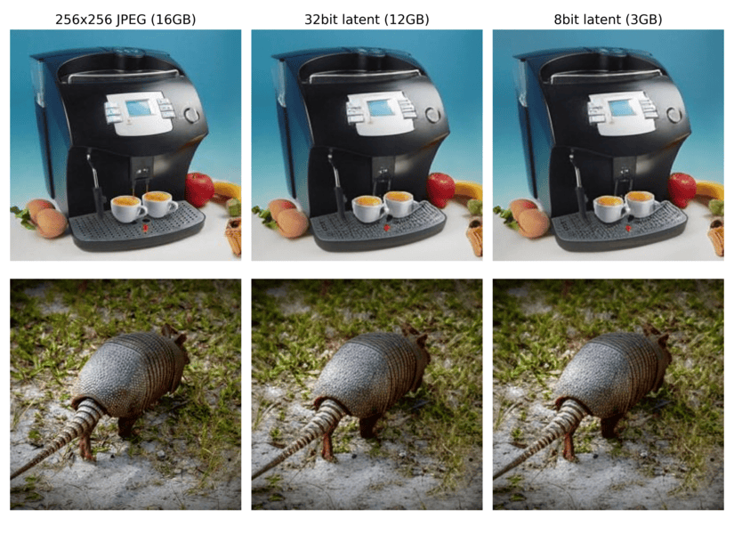

# Imagenet.3GB: Entire Imagenet dataset in 3GB

Original ImageNet is **138GB**, which makes it inconvenient to store and use for many applications. Inspired by [Imagenet.int8](https://huggingface.co/datasets/cloneofsimo/imagenet.int8) by Simo Ryu, I wanted to apply the same **VAE + int8 quantization approach** but using a different VAE.

Instead of using **SDXL’s VAE** which encodes images into **(B, 4, 32, 32)**, I used **Google SANA’s VAE** from [this model](https://huggingface.co/mit-han-lab/dc-ae-f32c32-sana-1.1-diffusers), which encodes images into **(B, 32, 8, 8)**. This allows for **faster inference** and enables efficient **latent-space diffusion**.

---

## Storage Comparison

- Original ImageNet (JPEG full dataset) - **138GB**
- Resized & Center-cropped ImageNet (JPEG 256x256) - **16GB**
- Float32 Latent Representation (SANA’s VAE) - **12GB**
- Quantized 8-bit Latent Representation (This Dataset) - **3GB**



---

## How to Use This Dataset

The dataset is available on Hugging Face:  
[irotem98/imagenet_3gb](https://huggingface.co/datasets/irotem98/imagenet_3gb/tree/main)

### Encoding ImageNet

To encode ImageNet into **8-bit latent representations**, use the script:

    encode_imagenet.py

This script processes the dataset, encodes it using **Google SANA’s VAE**, and saves the output in `imagenet_3gb.pt`.

### Decoding and Viewing a Sample Image

To load a sample image from the encoded dataset and decode it back into an image, use the script:

    load_image.py

This script takes a **latent vector stored in imagenet_3gb.pt**, dequantizes it back to float32, decodes it using SANA’s VAE, and saves the output.

---

## Why Use This?

Instead of storing or processing ImageNet in full resolution, this dataset lets you **work in latent space**, significantly reducing storage and compute costs. Models trained directly on these latents can take advantage of:
- **Faster training** (working with 8×8 spatial resolution instead of 256×256)
- **Lower VRAM usage** for generative models
- **Compatibility with latent diffusion architectures** (like Google SANA)

---

## Citation

This dataset was inspired by [Imagenet.int8](https://huggingface.co/datasets/cloneofsimo/imagenet.int8). If you found this dataset helpful, consider citing:

```bibtex
@misc{imagenet_3gb,
  author       = {Rotem Israeli},
  title        = {Imagenet.3GB: Compressed ImageNet using Google SANA’s VAE},
  year         = {2024},
  publisher    = {Hugging Face Datasets},
  url          = {https://huggingface.co/datasets/irotem98/imagenet_3gb},
  note         = {Entire ImageNet dataset compressed to 3GB using SANA’s VAE and quantized with int8}
}

@misc{imagenet_int8,
  author       = {Simo Ryu},
  title        = {Imagenet.int8: Entire Imagenet dataset in 5GB},
  year         = {2024},
  publisher    = {Hugging Face Datasets},
  url          = {https://huggingface.co/datasets/cloneofsimo/imagenet.int8},
  note         = {Entire Imagenet dataset compressed to 5GB using VAE and quantized with int8}
}
```
